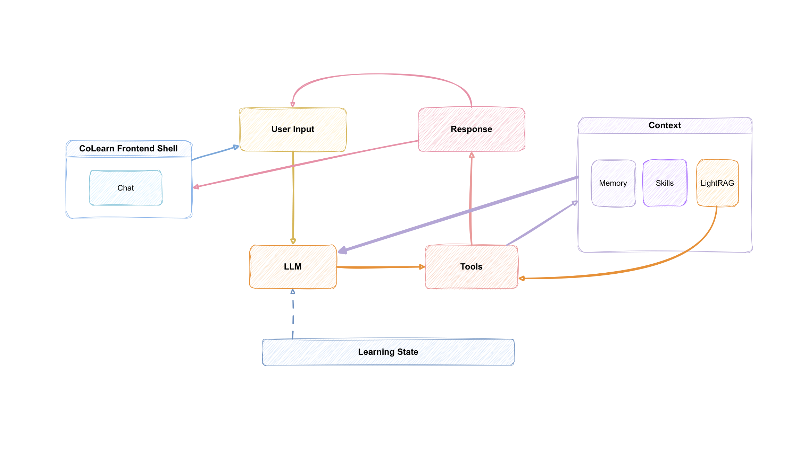

# CoLearn

CoLearn 是一个面向真实学习过程的 AI 学习工作台。

我们不是在做另一个聊天壳子，而是在围绕“学习循环”本身做产品设计：设定方向、收集资料、保持上下文、沉淀记忆、继续推进，让每一轮工作自然接到下一轮。

这个仓库，就是这套想法正在被落地的工作台。

## 产品理念

CoLearn 的出发点很简单：学习不是一次回答，而是一个持续推进的过程。

所以我们在做产品时，会坚持几个判断：

- 学习应该被建模成一轮一轮的推进，而不是孤立的提问。
- 知识源应该服务于具体学习任务，而不是只做被动检索。
- 记忆应该变成后续学习真正有用的状态，而不是只保存聊天记录。
- 前端、后端、编排、检索和诊断应该服务同一条学习流，而不是各自抢中心。
- 产品设计要优雅、简洁、高效，即使底层能力越来越强，界面和流程也要保持克制。

我们很在意“形状”。一个产品可以很有技术野心，但仍然保持平静、清晰、轻巧的使用感。

## CoLearn 在做什么

今天的 CoLearn 正在长成一个学习工作台，核心表面包括：

- 项目
- 学习会话
- 资料源库和文件处理
- 基于 WebSocket 的轮次编排
- 结构化学习状态
- 记忆面板和上下文支持
- 设置页诊断和服务商检查
- 本地轻量认证，方便联调

我们的目标不是堆功能，而是让这些能力彼此配合，最后形成一个连贯的工作空间。

## 架构设计

我们的架构风格刻意保持克制。

### 架构图



架构图源文件保留在这里： [colearn-architecture-source.pdf](D:/Colearn-nightly/CoLearn-docs/assets/colearn-architecture-source.pdf)

### 1. 从学习回合出发

我们不是先做一堆通用 agent 能力，再去寻找产品落点。

我们先问：一轮真实学习需要什么？

然后再围绕这轮学习去组织状态、工具、检索、记忆和 UI。

### 2. 边界清楚

当前主线的分工很明确：

- `colearn/api` 负责入口、路由和运行时对外接口
- 编排与执行层负责单轮装配
- `LearningState` 负责结构化学习进度
- 检索、记忆和压缩作为可组合的支撑能力
- `web/` 负责可用的前端表面

这样系统会更容易理解，也更容易继续长大。

### 3. 先证明闭环，再扩大平台

我们更愿意先把真实闭环做通，再谈更大的未来。

所以流程通常是：先做一条薄的端到端链路，再用测试、文档和联调把它钉稳，最后才扩展范围。

## 这次推进得很快

这个仓库里有一个我很喜欢的特征：它没有在“概念”里停很久。

当前的主产品骨架，大约是在一天左右的集中推进里搭出来的：

- 后端主线组装完成
- `LearningState` 协议落地并接入
- 项目、会话、记忆、资料源流程串起来了
- 前后端联调缺的路由补上了
- 测试、交接说明和架构文档开始贴近代码事实

它现在还是一个 nightly 工作台，不是最终成品。但它已经有了最重要的东西：一条真实、优雅的骨架。

## 当前对齐状态

仓库里现在已经包含这些主链路：

- `projects`
- `sessions`
- `memory`
- `skills`
- `settings`
- 统一聊天和回合 WebSocket 流
- 本地认证接口
- 知识库任务进度流
- 知识文件预览和下载路径
- settings 诊断事件流

最新补齐的后端接口包括：

- `GET /api/v1/auth/status`
- `POST /api/v1/auth/login`
- `POST /api/v1/auth/register`
- `GET /api/v1/auth/is_first_user`
- `POST /api/v1/auth/logout`
- `GET /api/v1/knowledge/tasks/{task_id}/stream`
- `WS /api/v1/knowledge/{name}/progress/ws`
- `GET /api/v1/knowledge/{name}/files/{file_path}`
- `GET /api/v1/settings/tests/{service}/{run_id}/events`

## 目录结构

- `colearn/`：后端代码和运行时装配
- `tests/`：后端测试覆盖
- `web/`：Next.js 前端工作区
- `CoLearn-docs/`：架构、执行和交接文档
- `third_party/nanobot-core/`：作为基础使用的上游运行时材料
- `.colearn/state/`：本地运行状态

## 本地启动

### Python

```powershell
cd D:\Colearn-nightly
python -m venv .venv
.venv\Scripts\activate
python -m pip install --upgrade pip
python -m pip install fastapi uvicorn httpx anyio pytest pydantic python-multipart
```

### Node

```powershell
cd D:\Colearn-nightly\web
npm install
npx playwright install
```

## 本地运行

### 启动后端

```powershell
cd D:\Colearn-nightly
python -m uvicorn colearn.api.app:app --host 127.0.0.1 --port 8001
```

### 启动前端

```powershell
cd D:\Colearn-nightly\web
$env:NEXT_PUBLIC_API_BASE='http://127.0.0.1:8001'
$env:NEXT_PUBLIC_AUTH_ENABLED='true'
npm run dev -- --hostname 127.0.0.1 --port 3000
```

然后打开 [http://127.0.0.1:3000](http://127.0.0.1:3000)。

## 测试命令

### 后端 API 测试

```powershell
cd D:\Colearn-nightly
pytest tests\test_api_app.py
```

### 后端完整测试

```powershell
cd D:\Colearn-nightly
python -m pytest tests
```

### 前端 Node 测试

```powershell
cd D:\Colearn-nightly\web
npm run test:node
```

### Playwright 常规检查

```powershell
cd D:\Colearn-nightly\web
npm run audit
```

### Playwright 真实联调冒烟

```powershell
cd D:\Colearn-nightly\web
npm run audit:live
```

## 文档入口

建议先看这些：

- [CoLearn Docs](D:/Colearn-nightly/CoLearn-docs/README.md)
- [顶层组装路径](D:/Colearn-nightly/CoLearn-docs/02-Architecture/CoLearn-%E9%A1%B6%E5%B1%82%E7%BB%84%E8%A3%85%E8%B7%AF%E5%BE%84.md)
- [LearningState 协议](D:/Colearn-nightly/CoLearn-docs/02-Architecture/CoLearn-LearningState-%E5%8D%8F%E8%AE%AE.md)
- [学习循环实施手册](D:/Colearn-nightly/CoLearn-docs/02-Architecture/CoLearn-%E5%AD%A6%E4%B9%A0%E5%BE%AA%E7%8E%AF%E5%AE%9E%E6%96%BD%E6%89%8B%E5%86%8C.md)
- [后端代码补全计划](D:/Colearn-nightly/CoLearn-docs/02-Architecture/CoLearn-%E5%90%8E%E7%AB%AF%E4%BB%A3%E7%A0%81%E8%A1%A5%E5%85%A8%E8%AE%A1%E5%88%92.md)
- [Claude 联调交接](D:/Colearn-nightly/CoLearn-docs/04-Claude-Handoffs/CoLearn-Claude-%E8%81%94%E8%B0%83%E8%A1%A5%E5%BC%BA%E4%BA%A4%E6%8E%A5%E8%AF%B4%E6%98%8E.md)

## 致谢

CoLearn 不是凭空长出来的。几个开源项目给了我们很大的支持，我们很感谢它们。

- [nanobot](https://github.com/HKUDS/nanobot)：给了我们核心 agent runtime 的思路和一个很有用的实践底座
- [OpenClaw](https://github.com/openclaw/openclaw)：在 skill 系统和工具组合方式上提供了很强的启发
- [LightRAG](https://github.com/HKUDS/LightRAG)：帮助我们塑造了面向知识工作的检索思路
- [Next.js](https://nextjs.org/)：提供了快速、可靠的前端基础
- [FastAPI](https://fastapi.tiangolo.com/)：提供了干净利落的后端接口层
- [Playwright](https://playwright.dev/)：让我们能真正验证界面和联调用法

开源大幅缩短了我们的路径。没有这些项目和它们背后的社区，当前这版 CoLearn nightly 不会这么快长出来。

## 收尾

CoLearn 还很早，但它已经不模糊了。

我们现在有了产品方向，有了可见的架构风格，有了正在工作的集成主线，也有了一个开始能自己说明自己的仓库。

这就是一个很好的起点。
